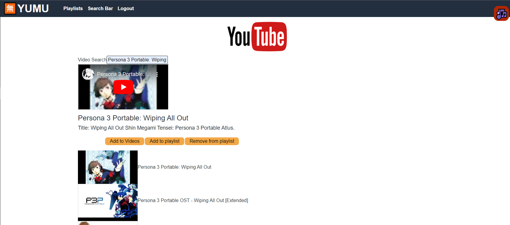
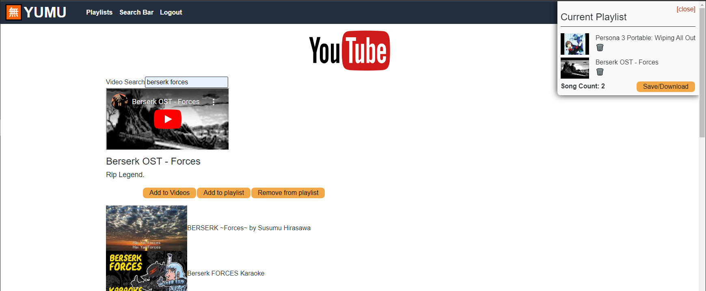

# Yumu 

With thousands of uploaded youtube videos/songs being lost every day; I aim to make an an application with the purpose of creating, sharing and saving playlists  for these lost youtube videos so that they are never lost. This app is still in progress and I hope to eventually get it to the point where I can share it with everyone who would like to use it. Which leads me to my next point (see the [Work in Progress]() section)...

 

## Table of Contents
  - [Overview](#-overview)
  - [Work in Progress](#work-in-progress)
  - [Technologies](#-technologies)
  - [Images](#-images)

 

## Overview

The overrall method of how this website operates (and will try to operate) will be centered around a user creating an account, allowing them to search whatever videos/songs they'd like via use of Google's Youtube API. Once the right video is found the user will have the option to add the video to a playlist through IDB, which sets the data up perfectly for the application to align with the models set up for sotring the video's metadata up into a database (with mongoDB). Once this is done, the ytdl npm module will allow users to download their playlists by calling that metadata from the database, through Amazon's simple storage service; will have the application upload the videos to the cloud and allow them to download said videos...
This is the functionality I'm looking for, truly keeping all the desired songs and videos forever. Even if the content is taken down on youtube, it will still be on my website.

 

|                       Technologies Used                        |
| :------------------------------------------------------------: |
|                             HTML5                              |
|                              CSS3                              |
|                         JavaScript ES6                         |
|                [NodeJS](https://nodejs.org/en/)                |
| [bcrypt](https://www.npmjs.com/package/bcrypt)                 |
|              [graphql](https://graphql.org/)                   |
|[Apollo](https://www.apollographql.com/docs/studio/explorer/sandbox/)|
|                [Mongoose](https://mongoosejs.com/)              |
|     [Yt-dl Core](https://www.npmjs.com/package/ytdl-core)       |
| [IndexedDB](https://www.npmjs.com/package/idb)|
| [Youtube v3 Search API](https://developers.google.com/youtube/v3)|
 

## Images

 
 
## Work in Progress

There are many things that I still need to iron out for this application to have before the application truly has all of the functionality that I'm looking for. [I'll also link my kan ban board for this project](https://github.com/users/Servbt/projects/4) section.

## v 0.1.0
> - UI/UX Design overhaul
> - Apollo and query overhaul 
> - User interactivity where one can follow and share playlists
> - History tab that shows previous videos
>
>
>More functionality on the way